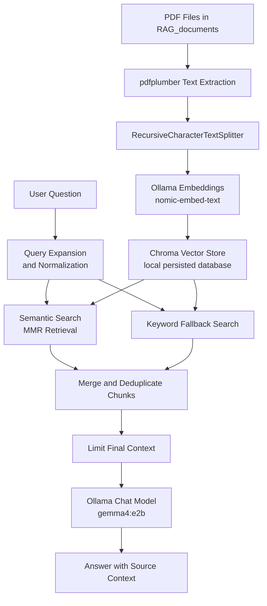

# RAG_Local

A local Retrieval-Augmented Generation (RAG) script that reads your PDF documents and answers questions using Ollama plus Chroma.

## Main File

- `rag.py`: end-to-end ingestion and interactive question answering

## What It Does

- Loads PDF files from a local `RAG_documents/` folder
- Extracts text with `pdfplumber`
- Splits content into chunks
- Stores embeddings in a local Chroma vector store
- Retrieves relevant context and answers questions with Ollama

## Architecture



## Request Flow

1. New PDFs are read from `RAG_documents/`.
2. Text is extracted and split into chunks.
3. Chunks are embedded with Ollama and stored in Chroma.
4. A user question is expanded into search-friendly variants.
5. The system retrieves relevant chunks using semantic search plus keyword fallback.
6. The best chunks are merged into a final context.
7. Ollama generates the answer from that context.

## Requirements

- Python 3
- Ollama installed and running
- Required Python packages installed

Install dependencies:

```bash
pip install -r requirements.txt
```

## Run

```bash
python rag.py
```

## Notes

- `RAG_documents/`, `chroma_db/`, and `processed_files.json` are local runtime/data artifacts and are not included in this publishable repo.
- If you change the embedding model, rebuild the vector store so old and new embeddings are not mixed.
